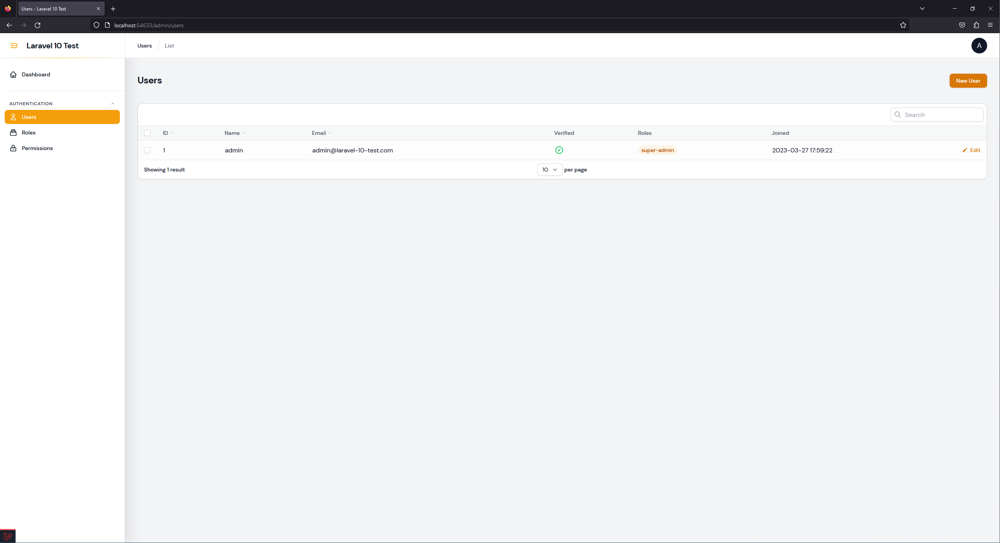
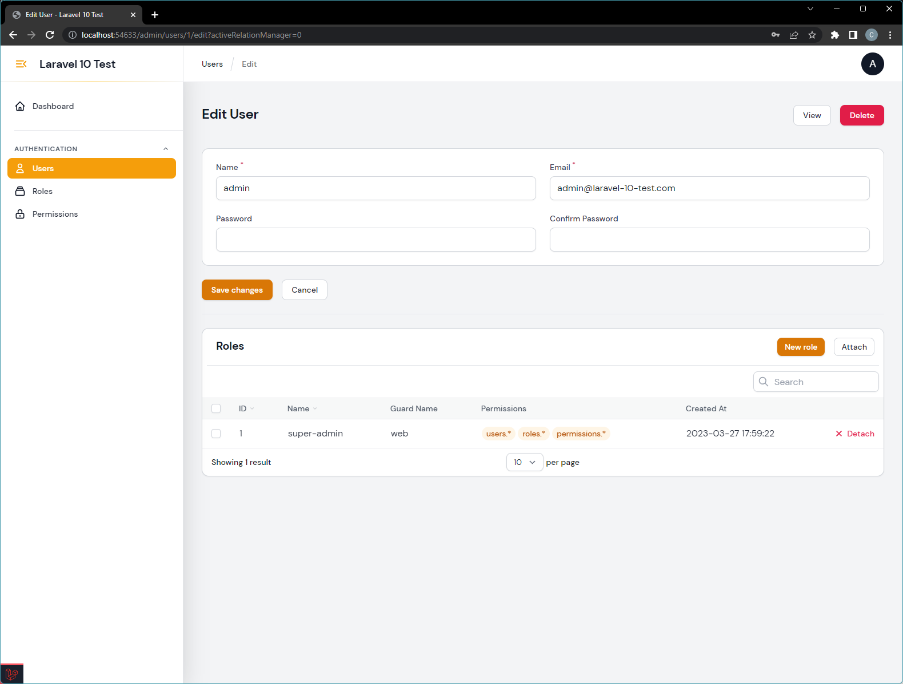
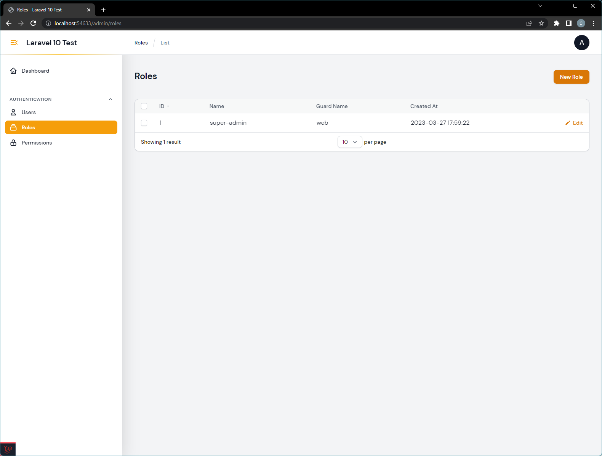
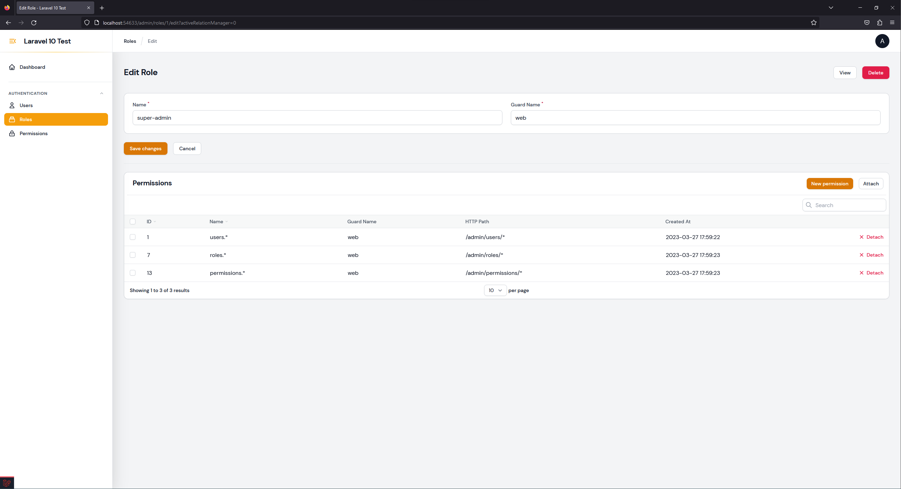
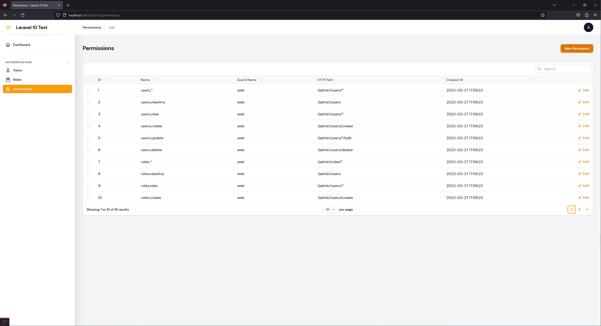
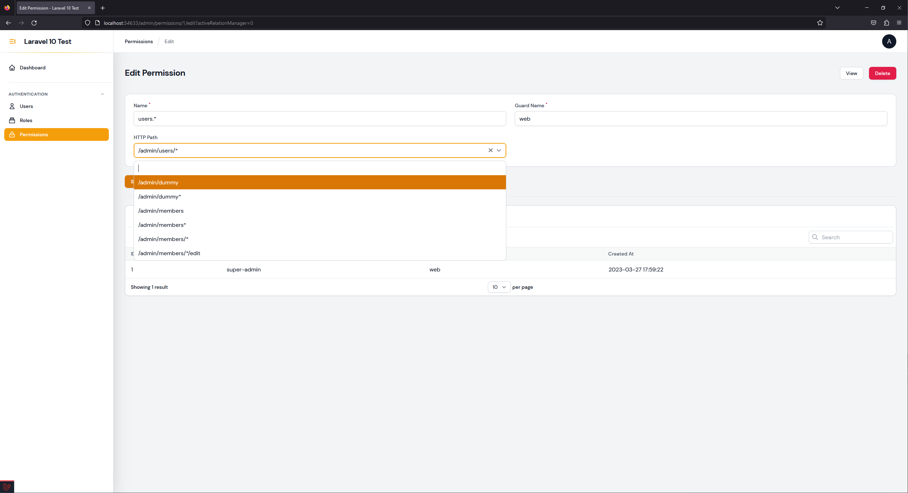

# filament-access-management

[](https://packagist.org/packages/solution-forest/filament-access-management)
[](https://github.com/solution-forest/filament-access-management/actions?query=workflow%3Arun-tests+branch%3Amain)
[](https://github.com/solution-forest/filament-access-management/actions?query=workflow%3A"Check+%26+fix+styling"+branch%3Amain)
[](https://packagist.org/packages/solution-forest/filament-access-management)


This is an authentication plugin for Filament Admin with Laravel-permission

## Installation

1. You can install the package via composer:
    ```bash
    composer require solution-forest/filament-access-management
    ```

2. **Clear your config cache**:
   ```bash
    php artisan optimize:clear
    # or
    php artisan config:clear
   ```
3. Then execute the following commands:
   ```bash
   php artisan filament-access-management:install
   ```
    This command will automatically run migration, publish `config/permission.php` and `config/filament-access-management.php` Configuration files, and create a **Super Admin User**:
    ```bash
    Email: 'admin@' . Str::of(config('app.name'))->slug() . '.com'
    Password: admin
    ```

4. In your config/app.php place this code in you providers section
    ``` php
    'providers' => [

        ...

        /*
            * Package Service Providers...
            */
        \SolutionForest\FilamentAccessManagement\FilamentAuthServiceProvider::class,

        ...

    ],
    ```
5. Add the necessary trait to your User model:

    ```php

    use SolutionForest\FilamentAccessManagement\Concerns\FilamentUser;

    class User extends Authenticatable
    {
        use FilamentUser;
    }
    ```

## Publish View and Migrations

You can publish the views, lang and migrations with:

```bash
php artisan vendor:publish --tag="filament-access-management-views"

php artisan vendor:publish --tag="filament-access-management-translations"

php artisan vendor:publish --tag="filament-access-management-migrations"
```

## Migration

```bash
php artisan migrate
```

## Usage

Create super admin user:

```bash

php artisan make:super-admin-user

```

Check permission:
```bash

# Check by permission's name
\SolutionForest\FilamentAccessManagement\Http\Auth\Permission::check($name)

# Check by http_path
\SolutionForest\FilamentAccessManagement\Http\Auth\Permission::checkPermission($path)

```

Get current user:
``` bash

\SolutionForest\FilamentAccessManagement\Facades\FilamentAuthenticate::user();

```








## Changelog

Please see [CHANGELOG](CHANGELOG.md) for more information on what has changed recently.

## Contributing

Please see [CONTRIBUTING](.github/CONTRIBUTING.md) for details.

## Security Vulnerabilities

Please review [our security policy](../../security/policy) on how to report security vulnerabilities.

## Credits

- [Carly](https://github.com/n/a)
- [All Contributors](../../contributors)

## License

The MIT License (MIT). Please see [License File](LICENSE.md) for more information.
